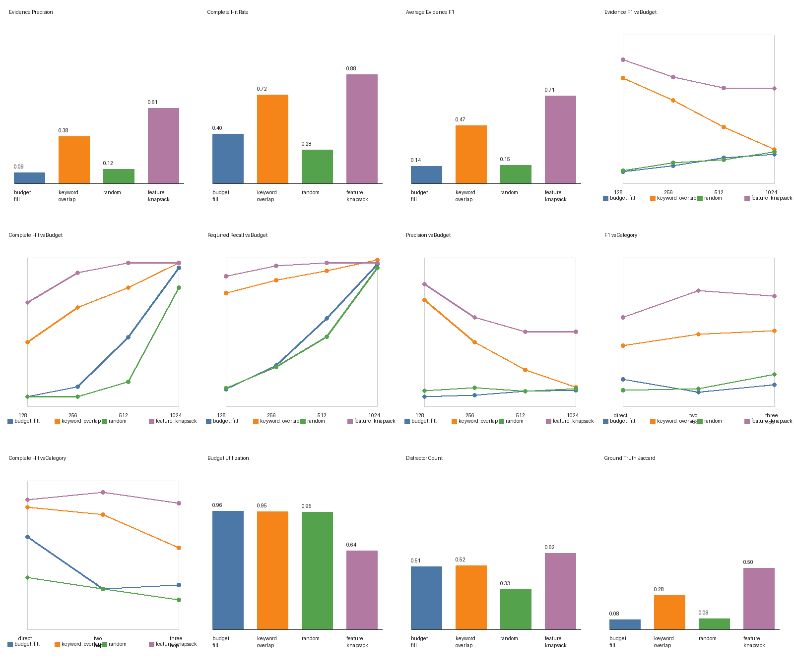

# LIMITS

**Learning to Identify Minimal Information under Token and Synergy constraints**

LIMITS is a context-selection project for RAG-style systems. The goal is to choose the most useful evidence chunks for a query under a fixed token budget, so the final LLM receives enough context to answer accurately without unnecessary computation cost.

The project is being built in two major stages:

1. A strong feature-based knapsack baseline for token-constrained evidence selection.
2. A sequential reinforcement learning selector that decides whether to include, skip, or stop while tracking remaining budget.

The current focus is the dataset, evaluator, baseline selectors, and the strongest transparent knapsack we can build before moving to RL. RL is intentionally not implemented yet.

## Current Baseline Snapshot

The current baseline report is generated from two content collections across 30 questions and all four budgets.



Knapsack documentation:

```text
DOCS/KNAPSACK.md
```

Generated artifacts:

```text
reports/baselines/baseline_rows.json
reports/baselines/baseline_rows.csv
reports/baselines/baseline_summary.json
reports/baselines/baseline_collage.png
reports/baselines/failure_analysis.json
reports/baselines/failure_analysis.md
reports/baselines/knapsack_debug.json
reports/baselines/knapsack_debug.md
reports/baselines/knapsack_inspection.json
reports/baselines/knapsack_inspection.md
```

Current baseline summary:

| Method | Evidence F1 | Complete Hit Rate | Required Recall | Optional Support Recall | Budget Utilization | Avg Distractors |
|---|---:|---:|---:|---:|---:|---:|
| `budget_fill` | 0.143 | 0.400 | 0.487 | 0.267 | 0.956 | 0.508 |
| `keyword_overlap` | 0.471 | 0.717 | 0.880 | 0.821 | 0.953 | 0.517 |
| `random` | 0.169 | 0.233 | 0.463 | 0.379 | 0.950 | 0.400 |
| `feature_knapsack` | 0.710 | 0.883 | 0.940 | 0.850 | 0.638 | 0.617 |

This benchmark now uses one canonical knapsack implementation: a fixed MiniLM embedding backend plus sparse lexical features, exact subset search, redundancy penalty, and explicit pair/triple interaction terms. The current tuning moderately strengthens paragraph-chain linkage because the remaining misses are mostly final-hop evidence scoring failures, not candidate-pool failures. The embedding backend is `sentence-transformers/all-MiniLM-L6-v2`; there is no lexical fallback because this is a benchmark, not a convenience demo.

The first failure analysis shows:

```text
feature_knapsack complete cases: 106/120
missing required evidence cases: 14/120
cases with selected distractors: 50/120
main weak category: three_hop
```

The current knapsack debug report splits incomplete cases by likely cause:

```text
scoring_failure: 7
distractor_failure: 7
```

There are currently no prefilter failures in the debug report. That means the candidate buffer is usually wide enough to contain the required evidence, and the next serious improvement is not more blind expansion. It is better scoring inside hard candidate pools, especially when wrong but query-similar distractors compete with true evidence.

## How The Knapsack Works

The feature knapsack is not allowed to look at ground truth during selection. It receives:

```text
query
candidate paragraphs
token budget
```

It returns:

```text
selected paragraph ids where total tokens <= budget
```

The current implementation is in:

```text
src/semantic_features.py
src/knapsack_features.py
src/utility.py
src/oracle.py
```

The strategy is:

1. **Compute public sparse and dense text features**
   - Sparse features use normalized query/paragraph terms with stopword removal.
   - Dense features use `sentence-transformers/all-MiniLM-L6-v2` cosine similarity through normalized embeddings.
   - The selector fails clearly if the fixed embedding dependency is unavailable.

2. **Build a 15-paragraph candidate pool**
   - Keep the strongest sparse query-overlap candidates.
   - Keep the strongest dense query-similarity candidates.
   - Fill the remaining slots using hybrid individual score plus seed linkage.
   - This prevents the benchmark from becoming lexical-only while still preserving useful keyword hints.

3. **Compute individual importance**
   - Each candidate receives value from sparse query coverage, sparse term hits, dense query similarity, sparse seed linkage, dense seed linkage, and budget-aware token cost:
     ```text
     individual =
       3.0 * query_term_coverage
       + 0.15 * query_term_hits
       + 0.5 * dense_query_similarity
       + 3.0 * best_sparse_seed_link
       + 0.3 * best_dense_seed_link
       - 1.0 * selection_penalty
       - 1.0 * paragraph_tokens / budget
     ```
   - This allows bridge evidence to enter even when it has weak direct query wording.

4. **Compute pair synergy**
   - Pair synergy rewards query-term complementarity and sparse paragraph-to-paragraph linkage:
     ```text
     pair_synergy =
       2.0 * query_complementarity_gain
       + 1.3 * sparse_paragraph_link
     ```
   - Dense pair linkage is supported in the code but currently weighted as `0.0` because measured tuning showed it encouraged context bloat and more distractor selection.

5. **Compute third-order synergy**
   - Triple synergy rewards cases where three paragraphs together cover query terms better than the best pair:
     ```text
     triple_synergy = 1.25 * max(0, triple_coverage - best_pair_coverage)
     ```
   - This is an explicit third-order interaction approximation, not hidden oracle reasoning.

6. **Subtract redundancy**
   - Redundancy is computed for every selected pair, so if one paragraph is redundant with two other selected paragraphs, both pair penalties are subtracted.
   - The penalty combines sparse Jaccard overlap and dense paraphrase-like similarity above a threshold:
     ```text
     pair_redundancy =
       1.5 * lexical_jaccard
       + 0.75 * max(0, dense_similarity - 0.72) / (1 - 0.72)

     final penalty = 0.75 * sum(pair_redundancy)
     ```
   - This catches exact repetition and some paraphrased duplication without requiring ground-truth redundancy labels at inference time.

7. **Exact subset search**
   - After the 15-candidate pool is built, the optimizer evaluates every feasible subset under the token budget.
   - That is up to `2^15 = 32768` subsets per question-budget case.
   - It chooses the subset with the highest utility and does not need to fill the whole budget.

Current utility shape:

```text
U(S) =
  sum individual[i]
  + sum pair_synergy[i,j]
  + sum triple_synergy[i,j,k]
  - redundancy_weight * sum pair_redundancy[i,j]
```

Tie-breaking prefers:

```text
higher score
lower token usage
stable sorted ids
```

We are not adding a manual contradiction penalty yet. The reason is simple: keyword-based contradiction guesses can punish true evidence unfairly. A real contradiction feature should come from an NLI model, cross-encoder, or another meaning-aware verifier, and should be added deliberately after this semantic baseline is stable.

## Current Project Direction

In a real setting, the selector should receive only:

```text
query
candidate paragraphs/chunks
token budget
```

It should output:

```text
selected paragraph/chunk ids with total tokens <= budget
```

The selector should not be given direct access to ground-truth labels, dependency depth, or hop labels during inference. Those labels exist only for dataset construction, training reward, evaluation, and analysis.

## Dataset Design

The first validated content collection is stored in:

```text
data/limits_dataset.json
```

- 2 content collections:
  - `content_01_aero_support`
  - `content_02_clinic_access`
- 80 candidate paragraphs total
- candidate pool larger than 1024 tokens
- 30 questions total
- 10 direct questions
- 10 two-hop questions
- 10 three-hop questions
- budget constraints: `128`, `256`, `512`, `1024`

`content_02_clinic_access` is designed specifically to challenge lexical shortcuts:

- required evidence chunks often use low query-word overlap,
- distractors use many query words while stating the wrong fact,
- multi-hop chains use indirect labels and aliases,
- semantic similarity is helpful but still not enough to solve wrong-context distractors perfectly.

Question category is metadata only. It helps us analyze results by difficulty, but it should not control what the model sees.

## Evidence Model

The dataset uses evidence units instead of one fixed ground-truth list.

Each question can define:

- `required_evidence_units`: evidence needs that must be satisfied for the answer to be complete.
- `optional_support_units`: useful supporting context that higher budgets may include.
- `budget_ground_truth`: multiple acceptable selections for each budget.
- `redundancy_groups`: genuinely valid alternative evidence.
- `distractor_groups`: similar, outdated, contradictory, or partial chunks that should not count as correct evidence.

Example idea:

```text
required evidence:
  start_time: p05
  cart_location: p06 or p19

valid 128-token answers:
  [p05, p06]
  [p05, p19]

valid higher-budget answers:
  [p05, p06, p32]
  [p05, p19, p32]
```

This avoids unfairly forcing the model to match one authored paragraph when multiple evidence combinations can answer the question.

## Validation Rules Implemented

The dataset validator currently checks:

- content id is valid
- paragraph ids are unique
- paragraph token counts are positive
- total candidate tokens exceed 1024
- question ids are unique
- each category has 5 to 10 questions
- every question has required evidence units
- evidence alternatives reference known paragraphs
- required evidence can fit under the 128-token budget
- every budget has at least one acceptable ground-truth selection
- every ground-truth selection stays within its budget
- every ground-truth selection satisfies all required evidence units
- redundancy and distractor groups reference known paragraphs

## Current Source Layout

```text
src/
  benchmark.py       baseline benchmark runner and report generation
  contracts.py       basic benchmark data contracts
  dataset.py         dataset dataclasses and validation
  dataset_io.py      JSON dataset loader
  dataset_summary.py dataset health summaries
  evidence.py        evidence scoring helpers
  evaluator.py       method-agnostic selection evaluator and RL reward signal
  knapsack_debug.py  failure-cause diagnostics for the feature knapsack
  knapsack_features.py public feature builder and feature-based knapsack selector
  knapsack_inspector.py per-question score and candidate inspection report
  optimizer.py       current exact interaction optimizer wrapper
  oracle.py          exhaustive exact oracle for small candidate pools
  selectors.py       simple baseline selectors
  semantic_features.py fixed MiniLM semantic similarity backend
  synthetic.py       small synthetic examples
  utility.py         interaction utility model

scripts/
  run_baseline_benchmark.py
  run_failure_analysis.py
  run_knapsack_debug.py
  run_knapsack_inspection.py

tests/
  test_benchmark.py
  test_dataset.py
  test_dataset_io.py
  test_dataset_summary.py
  test_evaluator.py
  test_knapsack_debug.py
  test_knapsack_features.py
  test_knapsack_inspector.py
  test_semantic_knapsack_features.py
  test_selectors.py
  test_contracts.py
  test_evidence.py
  test_optimizer.py
  test_oracle.py
  test_synthetic.py
  test_utility.py
```

## Current Verification

Run the full test suite with:

```text
python -m pytest -q
```

The current codebase also regenerates the benchmark and diagnostic reports with:

```text
python scripts/run_baseline_benchmark.py
python scripts/run_failure_analysis.py
python scripts/run_knapsack_debug.py
python scripts/run_knapsack_inspection.py
```

## Next Tasks

1. Inspect the remaining 16 incomplete knapsack cases question by question.
2. Improve wrong-context handling without manual contradiction word assumptions.
3. Expand the dataset beyond the current two contents so the formulas cannot overfit one authored style.
4. Add a meaning-aware verifier only when it is clean enough to use both for knapsack analysis and later RL reward design.
5. After the knapsack baseline is stable across multiple contents, start the RL environment:
   - actions: `INCLUDE`, `SKIP`, `STOP`
   - state: query, current candidate, selected context summary, remaining budget
   - reward: evaluator-based final evidence quality under budget
